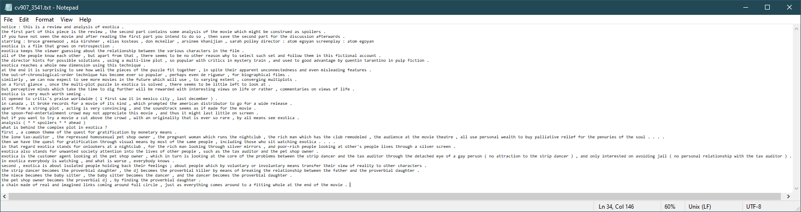
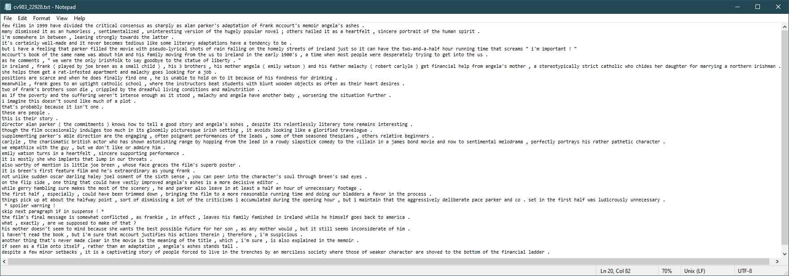
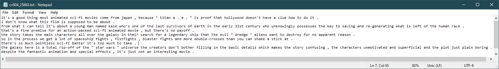
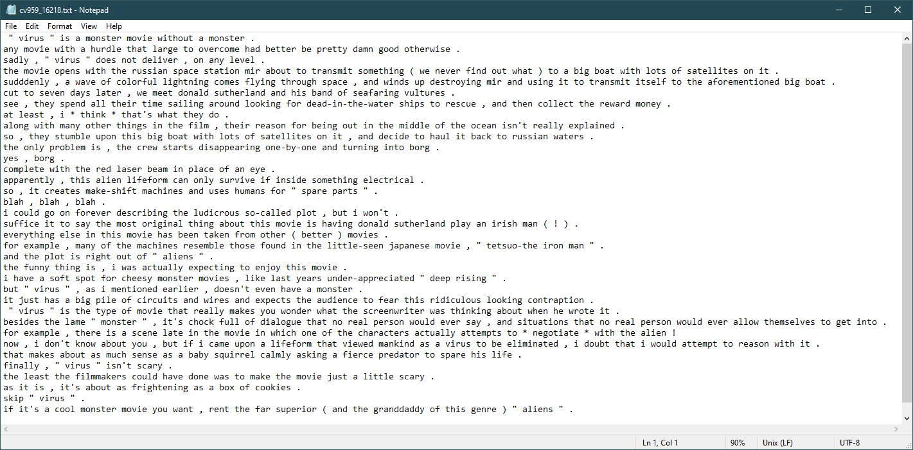
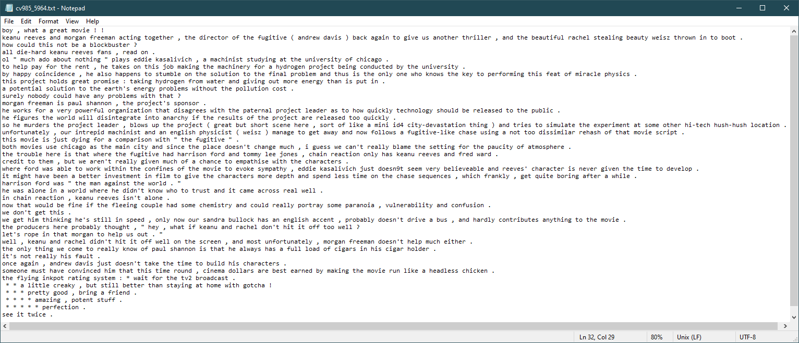
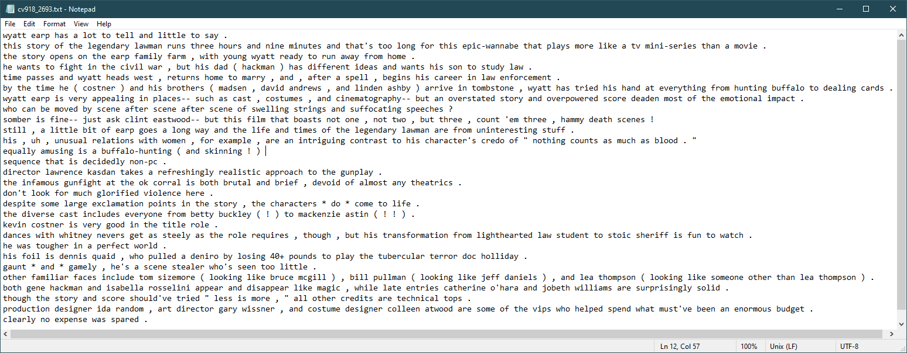
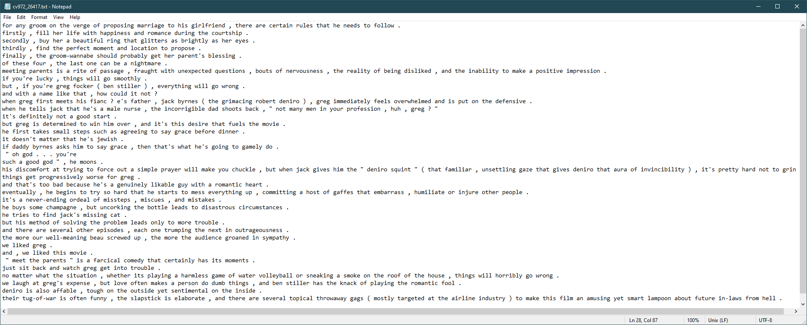
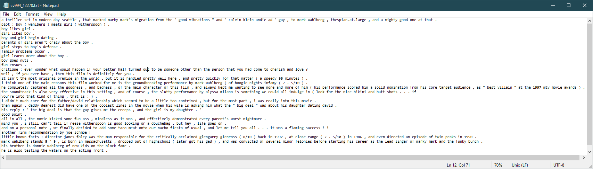
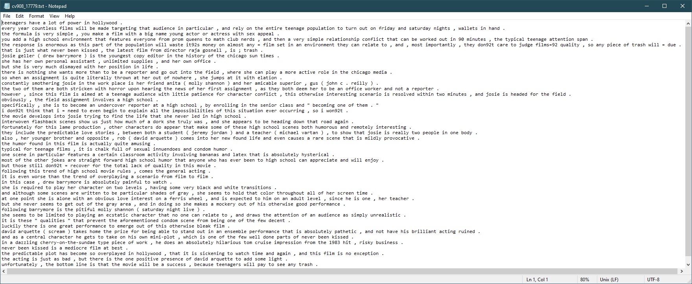
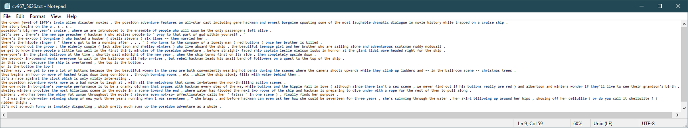

# Naive Bayes Classifier - Analysis
____

In this file I will look at 10 example predictions from my model and analyse the content
to determine why the model classified a document as a specific class. To do this I
will make use of the probabilities from my model to understand how close the classes
are to each other for a prediction and I also have the word probabilities available if
I feel they will lend to a more rounded insight into the prediction.

Note: All the class probabilities listed are the log probabilities found from getting
the log of all the words and summing them up.

## Correct predictions

We will look at 5 samples from the correct predictions, looking at 2 positive and 3 negative.

### Positive predictions
___

#### 1. cv907_3541.txt (Positive: -4897.788 Negative: -4932.056)

This review can be seen to be clearly positive after reading it. There is little
use of any negative language regarding any aspect of the movie, though the critic
doesn't use overly positive language either. The movie is supposedly worth seeing
and perceptive minds will be rewarded with interesting views on life. The use of
this positive language makes it apparent why this review is classed correctly as positive.
___

#### 2. cv983_22928.txt (Positive: -5388.773 Negative: -5426.454)

This reviews shows hints of negativity while still being overall positive. It has
been seen in both a negative and positive light, splitting critics. This particular
critic says it was well-made, and never becomes tedious. There is some strong
criticism that I would have believed would make the classes closer in probability.
The use of words such as interesting, charismatic, heartfelt, sincere, superb and
extraordinary weigh in favour of a positive classification.
___

### Negative predictions

___

#### 3. cv904_25663.txt (Positive: -1388.697 Negative: -1388.216)

This short review has a clear negative sentiment. The use of words such as boring,
rip-off, confusing and pointless give us an idea of this negative sentiment.
Looking at the probabilities for the classes we can see that they are quite close.
This is because the review is short, and there are some instances where there
is no context and a word may seem positive, like pay-off or interesting, which
are both used in a negative sense but seem positive when taking just the words.
___

#### 4. cv959_16218.txt (Positive: -3700.685 Negative: -3634.989)

This review can clearly be seen to have a negative sentiment, with the use of
words like sadly, ludicrous and ridiculous. The critic is not overly negative, and
it is surprising to me that the classes are not closer in probability as words 
such as original, funny, cool, superior are used, though they are negative in context.
The Naive Bayes can not consider this context however, so I would've expected a
less confident prediction for this negative review.
___

#### 5. cv985_5964.txt (Positive: -4537.217 Negative: -4515.558)

This negative review does not contain as much negative language as one may expect
from a negative review. Words such as paucity, boring, unfortunately, fault and headless.
Other negative words such as paranoia, vulnerability and confusion are used, but in
context it is talking about aspects that were not portrayed well considering the plot.
The rating system included at the bottom did not confuse the model as much as I 
would've expected.

___

## Incorrect predictions

Now we will look at 5 samples from the incorrect predictions, 3 positive and 2 negative
as the positive class performed worse.

### Positive reviews classed as negative

___

#### 6. cv918_2693.txt (Positive: -3515.203 Negative: -3499.625)

This review is classed as positive but as I read it I can see hints of negativity
that make it clear to see why a model may become confused. The critic talks of the movie
being too long and mentions that the overstated story and overpowered score deadens the
emotional impact. They refer to the speeches as suffocating. The use of the word uninteresting
also contributed to this being classified as negative. The critic also mentions a scene is brutal,
brief and devoid of theatrics. Though some of these can be chalked down to context,
other would lead even a person to believe that the critic was not a fan of the movie.
___

#### 7. cv972_26417.txt (Positive: -3810.270 Negative: -3808.222)

This review can be seen to be positive once reading it, but looking at the word choices
makes it clear how this review could be classed as negative. Words such as disliked, unexpected,
hell, wrong, overwhelmed, miscues, mistakes, make it seem as though this review is negative
when taken without context. As this is how a naive-bayes model operates it is clear to
see why a positive review containing words like this could be classed as negative.
___

#### 8. cv994_12270.txt (Positive: -3543.007 Negative: -3521.900)

After reading this review it is clear to see that the review has a positve sentiment.
Looking at the word usage throughout offers some insight into the mis-classification.
The use of words like mindless, contrived, worst, nightmare and creeps all have 
negative sentiment with no context, which is how our model is operating. There is 
also not a large catalogue of positive words being used that are truly discriminative
of a positive review. I believe this is why the review was mis-classified.
___

### Negative reviews classed as positive

___
#### 9. cv908_17779.txt (Positive: -6325.709 Negative: -6329.464)

This review seems to have a mixed sentiment at different parts of the review, with
an overall negative sentiment. The critic ridicules the movie and calls it predictable
and trash at several points. Sprinkled in among all of this is positive elements such
as parts are humorous and interesting. The critic also mentions one of the scenes with
sexual innuendos is hysterical. One of the actors, a David Arquette, is mentioned as
being particularly good and standing out from a pathetic ensemble. It is also mentioned
that it is likely that the movie will still be a success. Considering the use of 
language and the critic choosing to highlight positive aspects of the movie in the
review it is clear to see why this review was mis-classified.
___

#### 10. cv967_5626.txt (Positive: -4272.379 Negative: -4277.663)

This review is quite clearly a negative review when read, though taking each word individually
it can be seen why it may appear positive. The critic mentions that there is an all-star
cast, beautiful women and the race against the clock of the ship flooding is mildly
interesting. The word hilarious is used to describe a scene and funny is used in the
concluding line along with innately disgusting. Though it can be seen from reading the
review this is clearly the incorrect classification, looking at the language used it 
can be seen that there are elements of the review that come across as positive out of
context.
___
